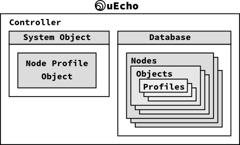
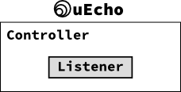
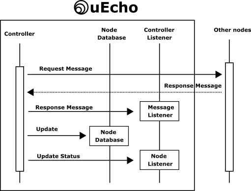

# Inside of uEcho Controller

## Node Profile Object

The controller is a special node of [ECHONETLite][enet] to control other nodes, but [ECHONETLite][enet] controller must have a following special node profile class object which has all children objects of the node [\[1\]][enet-spec].

- Class group code: 0x0E
- Class code: 0xF0
- Instance code: 0x01 (general node)

The uEcho added the node profile class objects automatically when the controller is created.

## Controller Message Listeners

Basically uEcho handles all messages from other nodes automatically. However, developer can set more detail user listeners into the node, objects and properties.

To set the listeners, use `uecho_controller_setmessagelistener`.

### Message Listener Sequences

After a node is received a message from other nodes, the node's listeners are called as the following sequences:

## References

- \[1\] [Part II ECHONET Lite Communication Middleware Specification][enet-spec]

[enet]:http://echonet.jp/english/
[enet-spec]:http://www.echonet.gr.jp/english/spec/index.htm
