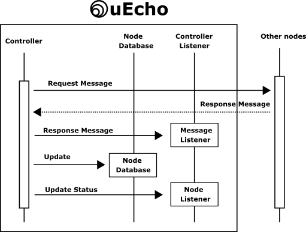

# Inside of uEcho Controller

Network discovery retains at most 64 remote nodes and 256 objects per node
(including the node profile). Additional entries are ignored once a limit is
reached; existing entries can still be updated. Build-time definitions
`UECHO_CONTROLLER_MAX_NODES` and `UECHO_CONTROLLER_MAX_OBJECTS_PER_NODE` can
adjust these limits for the application's memory budget. Discovery packets
must contain a node-profile source and a complete instance list whose declared
count matches its data length. Lists received in multiple packets continue to
be merged within the limits.

Library receive paths synchronize property buffer replacement and response
snapshots. Applications sharing raw pointers returned by property getters
between threads must still provide their own synchronization and keep the
owning node alive. Property callbacks run before the protected data update.

## Node Profile Object

The controller is a special node specified in [ECHONET Lite][enet] for controlling other nodes. The controller must implement the following special node profile class object that contains all child objects of the node [\[1\]][enet-spec].

- Class group code: 0x0E
- Class code: 0xF0
- Instance code: 0x01 (general node)

The `uecho` framework automatically adds the node profile class objects when the controller is created, so developers don't need to add these objects manually.

## Controller Message Listeners

The `uecho` framework handles all messages from other nodes automatically. However, developers can listen to messages directly using listener functions. After a node receives a message from other nodes, the controller listeners are called in the following sequence:

Developers can set a listener using `uecho_controller_setmessagelistener()` to monitor all received messages from other nodes. Additionally, developers can set a listener using `uecho_controller_setnodelistener()` to track node update status when nodes are updated by received messages.

## References

- \[1\] [Part II ECHONET Lite Communication Middleware Specification][enet-spec]

[enet]:http://echonet.jp/english/
[enet-spec]:https://echonet.jp/spec_object_rp_en/
