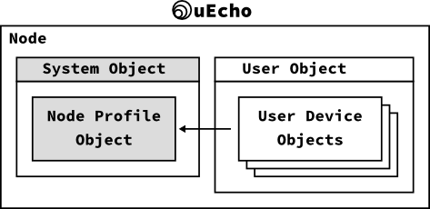
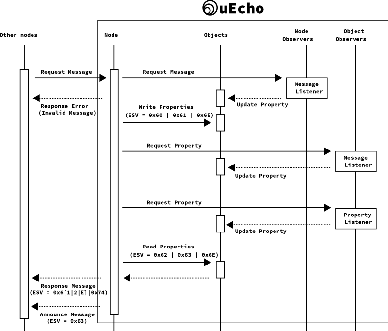

# Inside of uEcho Device

A [ECHONET Lite][enet] node includes the objects, and the objects can be classified into two types: profile objects and device objects. The profile object is standard profile information such as the operation status, manufacturer information, and device object list. The device object is a logical model of the information or of control items that can be remotely controlled. 

## Node Profile Object

The node profile object is a standard profile object, [ECHONET Lite][enet] node must have the following mandatory profile class object which has all children objects of the node [\[1\]][enet-spec].

- Class group code: 0x0E
- Class code: 0xF0
- Instance code: 0x01 (general node)

The `uecho` updates the node profile class objects automatically when the children node is changed, and so the developer doesn't need to update the node profile object yourself.

## Device Object Super Class

[ECHONETLite][enet] device node must have some mandatory properties [\[2\]][enet-spec]. The `uecho_device_new()` addes the following mandatory properties into the device object as default, and the developer should update the properties according to the device status.

| EPC | Property name | Default value |
|---|---|---|
| 0x80 | Operation status | 0x30 = ON |
| 0x81 | Installation location | 0x00 |
| 0x82 | Standard version information | Appendix F |
| 0x88 | Fault status | 0x42 = No fault has occurred |
| 0x8A | Manufacturer code | 0xFFFFF0 = Testing code |

The `uecho` add the following mandatory properties too. However, the developer doesn't need to update the mandatory properties because the `uecho` updates the mandatory properties automatically when any properties are added or removed.

| EPC | Property name |
|---|---|
| 0x9D | Status change announcement property map |
| 0x9E | Set property map  |
| 0x9F | Get property map |

## Device Message Listeners

Basically, the `uecho` handles all messages from other nodes automatically. However, developer can set some user listeners into the node, objects and properties to handle the messages from other nodes.

Using the user listeners, the developer can handle the write requests and update the internal status. To set the listeners, use `uecho_node_setmessagelistener`, `uecho_object_setmessagelistener` and `uecho_object_setpropertyrequeslistener`.

### Message Listener Sequences

After a node is received a message from other nodes, the node's listeners are called as the following sequences:

The developer can handle all request messages using the node message listener, and they can handle only valid messages using the object and property message listeners.

### Node Message Listener

The `uecho_node_setmessagelistener` can get all message for the node from other nodes, thus the message might be invalid.

### Object Message Listener

The `uecho` verifies the messages form other nodes using the objects and properties information of the node, and returns an error response when the message is invalid automatically. The `uecho_object_setmessagelistener` can get only valid messages for the object from other nodes.

### Property Message Listener

The `uecho_object_setpropertyrequeslistener` can get only valid request message for the object property from other nodes.

## Supported Basic Sequences

The `uecho` supports the following five basic sequences in ECHONET Lite Communication Middleware Specification [\[1\]][enet-spec].

### 4.2.1 Basic Sequences for Service Content

The `uecho` handles the five basic sequences automatically, thus the developer doesn't have to implement the responses directly. The property data is announced automatically when the property is changed using `uecho_property_setdata()`.

| Type | Description | Support |
|---|---|---|
| (A) | Basic sequence for receiving a request (no response required) | O |
| (B) | Basic sequence for receiving a request (response required) | O |
| (C) | Basic sequence for processing a notification request | O |
| (D) | Basic sequence for autonomous notification | O |
| (E) | Basic sequence for processing a request requiring a notification response | O |

### 4.2.2 Basic Sequences for Object Control in General

The `uecho` supports the following basic sequences too, and returns the error responses automatically. The developer doesn't have to receive and handle the error messages, but use `uecho_node_setmessagelistener()` if you want to listen the error messages.

| Type | Description | Support |
|---|---|---|
| (A) | Processing when the controlled object does not exist | O |
| (B) | Processing when the controlled object exists, except when ESV = 0x60 to 0x63, 0x6E and 0x74 | O |
| (C) | Processing when the controlled object exists but the controlled property does not exist or can be processed only partially | O |
| (D) | Processing when the controlled property exists but the stipulated service processing functions are not available | O |
| (E) | Processing when the controlled property exists and the stipulated service processing functions are available but the EDT size does not match | O |

## References

- \[1\] [Part II ECHONET Lite Communication Middleware Specification][enet-spec]
- \[2\] [Detailed Requirements for ECHONET Device objects][enet-spec]

[enet]:http://echonet.jp/english/
[enet-spec]:http://www.echonet.gr.jp/english/spec/index.htm
