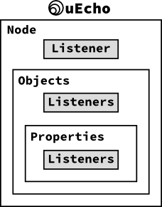

# Inside of uEcho Device

## Node Profile Object

[ECHONET Lite][enet] device node must have a following special node profile class object which has all children objects of the node [\[1\]][enet-spec].

- Class group code: 0x0E
- Class code: 0xF0
- Instance code: 0x01 (general node)

The uEcho updates the node profile class objects automatically when the children node is changed.

## Device Object Super Class

[ECHONETLite][enet] device node must have some properties [\[2\]][enet-spec]. To use `uecho_device_new()` or `uecho_device_addmandatoryproperties()`, the following mandatory properties are added into the node.

| EPC | Property name | Default value |
|---|---|---|
| 0x80 | Operation status | 0x30 = ON |
| 0x81 | Installation location | 0x00 |
| 0x82 | Standard version information | Appendix F |
| 0x88 | Fault status | 0x42 = No fault has occurred |
| 0x8A | Manufacturer code | 0xFFFFF0 = Testing code |

uEcho updates the following mandatory properties automatically too when any properties are added or removed.

| EPC | Property name |
|---|---|
| 0x9D | Status change announcement property map |
| 0x9E | Set property map  |
| 0x9F | Get property map |

## Device Message Listeners

Basically uEcho handles all messages from other nodes automatically. However, developer can set more detail user listeners into the node, objects and properties.

To set the listeners, use `uecho_node_setmessagelistener`, `uecho_object_setmessagelistener` and `uecho_object_setpropertyrequeslistener`.

### Message Listener Sequences

After a node is received a message from other nodes, the node's listeners are called as the following sequences:

### Node Message Listener

`uecho_node_setmessagelistener` can get all message for the node from other nodes, thus the message might be invalid.

### Object Message Listener

uEcho verifies the messages form other nodes using the objects and properties information of the node, and returns an error response when the message is invalid automatically. `uecho_object_setmessagelistener` can get only valid messages for the object from other nodes.

### Property Message Listener

`uecho_object_setpropertyrequeslistener` can get only valid request message for the object property from other nodes.

[enet]:http://echonet.jp/english/

## Supported Basic Sequences

uEcho supports the following five basic sequences in ECHONET Lite Communication Middleware Specification [\[1\]][enet-spec].

### 4.2.1 Basic Sequences for Service Content

uEcho handles the five basic sequences automatically, thus the developer doesn't have to implement the responses directly. The property data is announced automatically when the property is changed using `uecho_property_setdata()`.

| Type | Description | Support |
|---|---|---|
| (A) | Basic sequence for receiving a request (no response required) | O |
| (B) | Basic sequence for receiving a request (response required) | O |
| (C) | Basic sequence for processing a notification request | O |
| (D) | Basic sequence for autonomous notification | O |
| (E) | Basic sequence for processing a request requiring a notification response | O |

### 4.2.2 Basic Sequences for Object Control in General

uEcho supports the following basic sequences too, and returns the error responses automatically. The developer doesn't have to receive and handle the error messages, but use `uecho_node_setmessagelistener()` if you want to listen the error messages.

| Type | Description | Support |
|---|---|---|
| (A) | Processing when the controlled object does not exist | O |
| (B) | Processing when the controlled object exists, except when ESV = 0x60 to 0x63, 0x6E and 0x74 | O |
| (C) | Processing when the controlled object exists but the controlled property does not exist or can be processed only partially | O |
| (D) | Processing when the controlled property exists but the stipulated service processing functions are not available | O |
| (E) | Processing when the controlled property exists and the stipulated service processing functions are available but the EDT size does not match | O |

## References

- \[1\] [Part II ECHONET Lite Communication Middleware Specification][enet-spec]
- \[2\] [Detailed Requirements for ECHONET Device objects][enet-spec]

[enet-spec]:http://www.echonet.gr.jp/english/spec/index.htm
