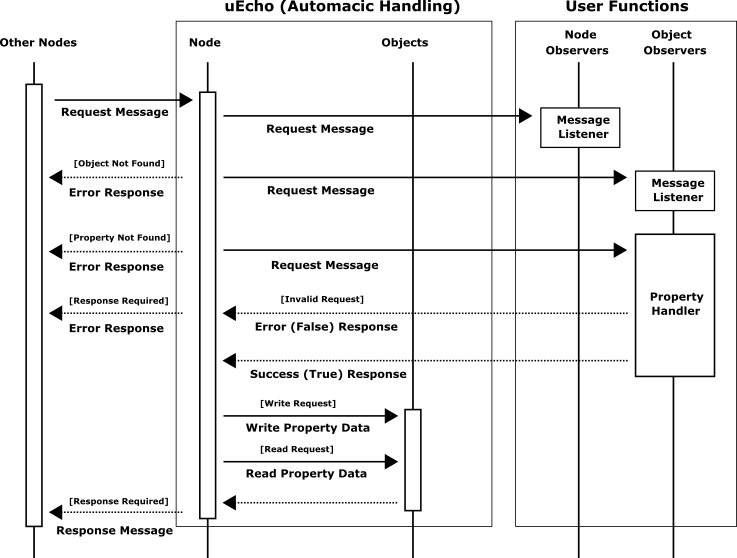

# Inside of uEcho Device

An [ECHONET Lite][enet] node contains objects that fall into two categories: profile objects and device objects. Profile objects store standard information such as operational status, manufacturer details, and device object lists. Device objects represent logical models of information or control items that support remote operation.


## Node Profile Object

The node profile object serves as a standard profile component. Every [ECHONET Lite][enet] node requires the following mandatory profile class object that encompasses all child objects within the node [\[1\]][enet-spec].

- Class group code: 0x0E
- Class code: 0xF0
- Instance code: 0x01 (general node)

The `uecho` framework automatically maintains node profile class objects when child objects change, eliminating the need for manual updates.

## Device Object Super Class

[ECHONET Lite][enet] device nodes require specific mandatory properties [\[2\]][enet-spec]. The `uecho_device_new()` function initializes these mandatory properties with default values, which developers should modify based on actual device status.

| EPC | Property name | Default value |
|---|---|---|
| 0x80 | Operation status | 0x30 = ON |
| 0x81 | Installation location | 0x00 |
| 0x82 | Standard version information | Appendix F |
| 0x88 | Fault status | 0x42 = No fault has occurred |
| 0x8A | Manufacturer code | 0xFFFFF0 = Testing code |

The `uecho` add the following mandatory properties too. However, the developer doesn't need to update the mandatory properties because the `uecho` updates the mandatory properties automatically when any properties are added or removed.

| EPC | Property name |
|---|---|
| 0x9D | Status change announcement property map |
| 0x9E | Set property map  |
| 0x9F | Get property map |

## Device Message Handler and Listener

The `uecho` handles all request messages from other nodes automatically, the developer need only control request message permissions from other nodes and controllers to the target object properties using the object property handlers of the `uecho`. However, the developer can set some request message listeners into the node and objects to listen the raw messages of [ECHONET Lite][enet] too. The following figure shows the message handling sequence of `uecho`.



The request message listeners of the node and object can listen all request messages, but the object property handlers receives only valid request messages.

### Property Message Handler

The `uecho_object_setpropertyrequesthandler()` can set the following permission handler to an object property to handle valid request messages from other nodes. 

```
typedef bool (*uEchoPropertyRequestHandler)(uEchoObject*, uEchoProperty*, uEchoEsv, size_t, byte *);
```

The developer handles the request messages from other nodes. The developer should return a true if the request message is valid, otherwise false. In addition, the developer does not need to update the target property data by the request property data because the `uecho` updates the target property by the request property data automatically when the handler returns true. The following example shows to check a write request message and set the valid property data to the target property.

```
bool object_property_handler(uEchoObject* obj, uEchoProperty* prop, uEchoEsv esv, size_t pdc, byte *edt)
{
  if (pdc != 1)
    return false;
  return true;
}
```

The `uecho_object_setpropertyrequesthandler()` sets the permission handlers each ESV (ECHONET Lite Service) of [ECHONET Lite][enet]. Terefore `uecho` offers the following sugar fuctions to set the  permission handlers more easily for the read and write request messages.

- uecho_object_setpropertyreadrequesthandler()
- uecho_object_setpropertywriterequesthandler()

The `uecho` handles the read and notification request messages automatically. Threfore, the developer can create a device of [ECHONET Lite][enet] only to handle write message requests using the `uecho_object_setpropertywriterequesthandler()`.

### Node Message Listener

The `uecho_node_setmessagelistener()` can set the following listener to get all message for the node from other nodes, thus the message might be invalid.

```
typedef void (*uEchoNodeMessageListener)(uEchoNode*, uEchoMessage*);
```

### Object Message Listener

The `uecho_object_setmessagelistener()` can set the following listener to get only valid messages for the object from other nodes.

```
typedef void (*uEchoObjectMessageListener)(uEchoObject*, uEchoMessage*);
```

## Supported Basic Sequences

The `uecho` supports the following five basic sequences in ECHONET Lite Communication Middleware Specification [\[1\]][enet-spec].

### 4.2.1 Basic Sequences for Service Content

The `uecho` handles the five basic sequences automatically, thus the developer doesn't have to implement the responses directly. The property data is announced automatically when the property is changed using `uecho_property_setdata()`.

| Type | Description | Support |
|---|---|---|
| (A) | Basic sequence for receiving a request (no response required) | O |
| (B) | Basic sequence for receiving a request (response required) | O |
| (C) | Basic sequence for processing a notification request | O |
| (D) | Basic sequence for autonomous notification | O |
| (E) | Basic sequence for processing a request requiring a notification response | O |

### 4.2.2 Basic Sequences for Object Control in General

The `uecho` supports the following basic sequences too, and returns the error responses automatically. The developer doesn't have to receive and handle the error messages, but use `uecho_node_setmessagelistener()` if you want to listen the error messages.

| Type | Description | Support |
|---|---|---|
| (A) | Processing when the controlled object does not exist | O |
| (B) | Processing when the controlled object exists, except when ESV = 0x60 to 0x63, 0x6E and 0x74 | O |
| (C) | Processing when the controlled object exists but the controlled property does not exist or can be processed only partially | O |
| (D) | Processing when the controlled property exists but the stipulated service processing functions are not available | O |
| (E) | Processing when the controlled property exists and the stipulated service processing functions are available but the EDT size does not match | O |

## References

- \[1\] [Part II ECHONET Lite Communication Middleware Specification][enet-spec]
- \[2\] [Detailed Requirements for ECHONET Device objects][enet-spec]

[enet]:http://echonet.jp/english/
[enet-spec]:http://www.echonet.gr.jp/english/spec/index.htm
