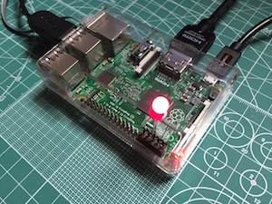

The `uecho-c` includes some sample implementations for controller and device of [ECHONET Lite][enet] in the `examples` directory.

# Examples for ECHONET Lite Controller

## uechosearch

The `uechosearch` is a sample controller to search all [ECHONET Lite][enet] nodes in the same local area network, and the usage is below.

```
Usage : uechosearch [options]
 -v : Enable verbose output
 -h : Print this message
```

The `uechosearch` searches all [ECHONET Lite][enet] device and profile objects in the local area network, and prints all found objects with the IP address as the following:

```
$ uechosearch
192.168.xxx.aaa 0EF001 --> (Node Profile Object)
192.168.xxx.aaa 05FF01 --> (Controller Object)
192.168.xxx.bb 0EF001  --> (Node Profile Object)
192.168.xxx.bb 0F2001  --> (User definition Class)
192.168.xxx.bb 029101  --> (Mono Functional Lighting)
```

## uechopost

The `uechopost` is a sample controller to post a message to a [ECHONET Lite][enet] node in the same local area network, and the usage is below.


```
Usage : uechopost [options] <address> <obj> <esv> <property (epc, pdc, edt) ...>
 -v : Enable verbose output
 -n : Disable unicast server
 -h : Print this message
```

The `uechopost` can send any request message of [ECHONET Lite][enet] to an object in the node, and prints the response message. The following example get the standard information from a [ECHONET Lite][enet] device, and control the power status.

```
$ uechopost
Usage : echopost <address> <obj> <esv> <property (epc, pdc, edt) ...>

$ uechopost 192.168.xxx.bb 029101 62 8A00 --> READ REQ : Manufacturer code (=0x8A)
192.168.xxx.bb 029101 72 8A0300000B       --> READ RES : Panasonic (=0x00000B)

$ uechopost 192.168.xxx.bb 029101 62 8200 --> READ REQ : Standard Version (=0x82)
192.168.xxx.bb 029101 72 820400004600     --> READ RES : Appenddix F (=0x46)

$ uechopost 192.168.xxx.bb 029101 62 8000  --> READ REQ : Operation status (=0x80)
192.168.xxx.bb 029101 72 800131            --> READ RES : OFF (=0x31)

$ uechopost 192.168.xxx.bb 029101 61 800130 --> WRITE REQ : Operation status ON (=0x30)
192.168.xxx.bb 029101 71 8000               --> WRITE RES : (No Data)

$uechopost 192.168.xxx.bb 029101 62 8000  --> READ REQ : Operation status (=0x80)
192.168.xxx.bb 029101 72 800131           --> READ RES : ON (=0x30)
```

## uechodump

The `uechodump` is a sample controller to print all multicast messages of [ECHONET Lite][enet] in the same local area network, and the usage is below.

```
Usage : uechodump [options]
 -n : Disable unicast server
 -h : Print this message
```

The `uechodump` prints all multicast packets of announce and notification messages from other node as the following:

```
$ uechodump
172.20.10.2 10 81 00 EF001 EF001 73 1 D5
172.20.10.2 10 81 00 EF001 EF001 73 1 D5
172.20.10.2 10 81 01 EF001 EF001 62 1 D6
....
```

# Examples for ECHONET Lite Devices

## uecholight

The `uecholight` is an implementation example of the standard mono functional light device object which is specified in the [ECHONET Lite][enet], and the usage is below.

```
Usage : uecholight
 -v        : Enable verbose output
 -m XXXXXX : Set Manufacturer code
 -h        : Print this message
 ```

The example device object is specified as the 'Requirements for mono functional lighting class' in the Detailed Requirements
for ECHONET Device objects[\[1\]][enet-spec], and the object code is below.

- mono functional lighting class
  - Class group code : 0x02
  - Class code : 0x91
  - Instance code 0x01

The `uecholight` outputs power status messages when the write requests are received form other nodes or controllers as the following:

```
$ uecholight
ESV = 80 : 30 (1)
POWER = ON
ESV = 80 : 31 (1)
POWER = OFF
```

For Raspberry Pi, `uecholight` outputs the lighting power status into the specified GPIO port.



To enable the GPIO function for Raspberry Pi, compile with UECHO_PLATFORM_RASPBIAN option and run `uecholight` with root privileges.

# References

- \[1\] [Detailed Requirements for ECHONET Device objects][enet-spec]

[enet]:http://echonet.jp/english/
[enet-spec]:http://www.echonet.gr.jp/english/spec/index.htm
