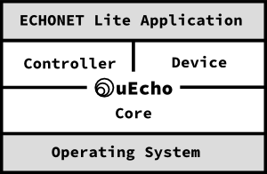

eEcho for C is a portable and cross platform development framework for creating controller applications and devices of [ECHONET Lite][enet]. [ECHONET][enet] is an open standard specification for IoT devices in Japan, it specifies more than 100 IoT devices such as crime prevention sensor, air conditioner and refrigerator.

## What is uEcho ?

The uEcho supports to control devices of [ECHONET Lite][enet] and create the standard devices of the specification easily. The uEcho is designed in object-oriented programming, and the functions are object-oriented in their naming convention, and are grouped into classes such as `Controller`, `Node`, `Class` and `Object`.

To implement IoT controller or devices of [ECHONET Lite][enet], developer had to understand and implement the communication middleware specification such as the message format and base sequences.

The uEcho is inspired by reactive programming too. Using the uEcho, developer have only to set basic listeners to implement the devices and controllers because uEcho handles other requests such as request and notification requests automatically.

# Table of Contents

- [What is uEcho ?](./uecho_overview.md)
- [Setup](./uecho_setup.md)
- Controller
  - [Overview of Controller](./uecho_controller_overview.md)
  - [Inside of Controller](./uecho_controller_inside.md)
- Device
  - [Overview of Device](./uecho_device_overview.md)
  - [Inside of Device](./uecho_device_inside.md)
- [Examples](./uecho_examples.md)

[enet]:http://echonet.jp/english/
