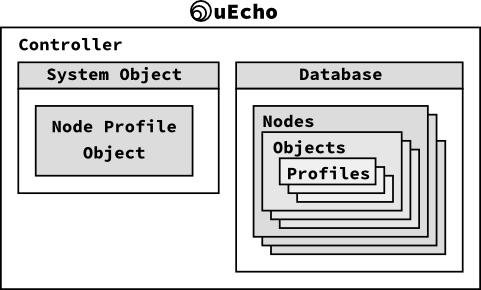

# Inside of uEcho Controller

## Node Profile Object

The controller is a special node of [ECHONETLite][enet] to control other nodes, but [ECHONETLite][enet] controller must have a following special node profile class object which has all children objects of the node [\[1\]][enet-spec].

- Class group code: 0x0E
- Class code: 0xF0
- Instance code: 0x01 (general node)

The uEcho added the node profile class objects automatically when the controller is created.

## References

- \[1\] [Part II ECHONET Lite Communication Middleware Specification][enet-spec]

[enet]:http://echonet.jp/english/
[enet-spec]:http://www.echonet.gr.jp/english/spec/index.htm
