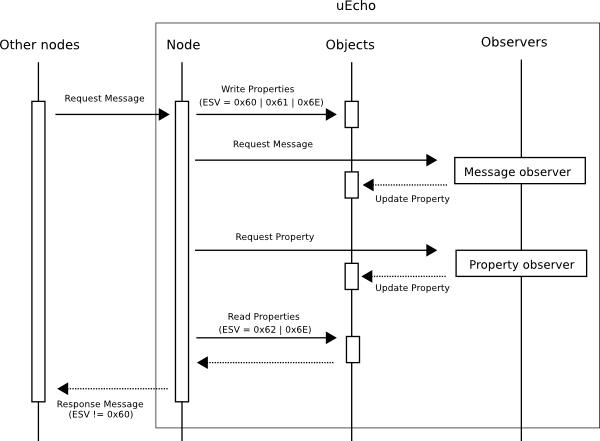

# uEcho for C

## Making Devices

uEcho supports your original standard devices of ECHONET Lite specification easily.

## Creating Devices

### 1. Creating Node

To create your original device, use `uecho_node_new` as the following at first.

```
uEchoNode *node = uecho_node_new();
```

The new node has only a node profile class object, and it has no device object. The node profile object is updated automatically when new devices are added into the node or the any properties in the node are changed.

### 2. Creating Device Object

The new node has no device object. To add your device objects, create a new device object using `uecho_object_new` or `uecho_device_new`. `uecho_object_new` create a null object, but `uecho_device_new` create a object which added some mandatory properties of ECHONET device object super class requirements.

Next, set the manufacturer code, the object code and other properties code into the created device object and add the device object into the node using `uecho_node_addobject()` as the following.

```
obj = uecho_device_new();
uecho_object_setmanufacturercode(obj, 0xXXXXXX);
uecho_object_setcode(obj, 0xXXXXXX);
....
uecho_object_setproperty(obj, 0xXX, uEchoPropertyAttrReadWrite);
uecho_object_setpropertydata(obj, 0xXX, ....., ....);
....
uecho_node_addobject(node, obj);
```

### 3. Setting Observers

Basically uEcho handles all messages from other nodes automatically.
To implement the device object, use some observer functions such as `uecho_node_setmessagelistener`, `uecho_object_setmessagelistener` and `uecho_object_setpropertyrequeslistener`.



`uecho_node_setmessagelistener` can get all message for the node from other nodes, thus the message might be invalid.

uEcho verifies the messages form other nodes using the objects and properties information of the node, and returns an error response when the message is invalid automatically. `uecho_object_setmessagelistener` can get only valid messages for the object from other nodes.

`uecho_object_setpropertyrequeslistener` can get only valid request message for the object property from other nodes.

### 4. Start Node

```
uecho_node_start(node);
```
