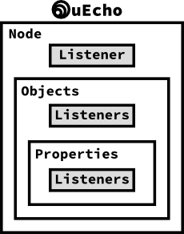

# Inside of uEcho Device

## Device Message Listeners

Basically uEcho handles all messages from other nodes automatically. However, developer can set more detail user listeners into the node, objects and properties.

To set the listeners, use `uecho_node_setmessagelistener`, `uecho_object_setmessagelistener` and `uecho_object_setpropertyrequeslistener`.

### Message Listener Sequences

After a node is received a message from other nodes, the node's listeners are called as the following sequences:

### Node Message Listener

`uecho_node_setmessagelistener` can get all message for the node from other nodes, thus the message might be invalid.

### Object Message Listener

uEcho verifies the messages form other nodes using the objects and properties information of the node, and returns an error response when the message is invalid automatically. `uecho_object_setmessagelistener` can get only valid messages for the object from other nodes.

### Property Message Listener

`uecho_object_setpropertyrequeslistener` can get only valid request message for the object property from other nodes.

[enet]:http://echonet.jp/english/
