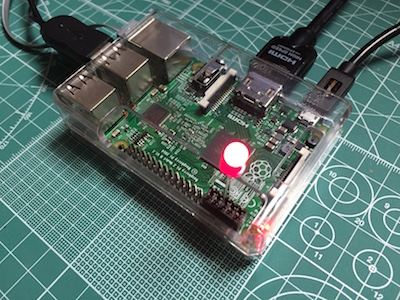

# uEcho Examples

uEcho includes sample implementations for controller and device of [ECHONET Lite][enet] in the `examples` directory.

## Examples for Controller

### uechosearch

```
Usage : uechosearch [options]
 -v : Enable verbose output
 -h : Print this message
```

`uechosearch` searches [ECHONET Lite][enet] devices in the local area network, and prints the found objects with the ip address as the follwoing:

```
$ uechosearch
192.168.xxx.aaa 0EF001 --> (Node Profile Object)
192.168.xxx.aaa 05FF01 --> (Controller Object)
192.168.xxx.bb 0EF001  --> (Node Profile Object)
192.168.xxx.bb 0F2001  --> (User definition Class)
192.168.xxx.bb 029101  --> (Mono Functional Lighting)
```

### uechopost

```
Usage : uechopost [options] <address> <obj> <esv> <property (epc, pdc, edt) ...>
 -v : Enable verbose output
 -n : Disable unicast server
 -h : Print this message
```

`uechopost` can send any request message of [ECHONET Lite][enet], and prints the response message. The following commands get the standard information from a [ECHONET Lite][enet] device, control the power status.

```
$ uechopost
Usage : echopost <address> <obj> <esv> <property (epc, pdc, edt) ...>

$ uechopost 192.168.xxx.bb 029101 62 8A00 --> READ REQ : Manufacturer code (=0x8A)
192.168.xxx.bb 029101 72 8A0300000B       --> READ RES : Panasonic (=0x00000B)

$ uechopost 192.168.xxx.bb 029101 62 8200 --> READ REQ : Standard Version (=0x82)
192.168.xxx.bb 029101 72 820400004600     --> READ RES : Appenddix F (=0x46)

$ uechopost 192.168.xxx.bb 029101 62 8000  --> READ REQ : Operation status (=0x80)
192.168.xxx.bb 029101 72 800131            --> READ RES : OFF (=0x31)

$ uechopost 192.168.xxx.bb 029101 61 800130 --> WRITE REQ : Operation status ON (=0x30)
192.168.xxx.bb 029101 71 8000               --> WRITE RES : (No Data)

$uechopost 192.168.xxx.bb 029101 62 8000  --> READ REQ : Operation status (=0x80)
192.168.xxx.bb 029101 72 800131           --> READ RES : ON (=0x30)
```

### uechodump

```
Usage : uechodump [options]
 -n : Disable unicast server
 -h : Print this message
```

The sample prints all multicast packets of announce and notification messages from other node as the following:

```
$ uechodump
172.20.10.2 10 81 00 EF001 EF001 73 1 D5
172.20.10.2 10 81 00 EF001 EF001 73 1 D5
172.20.10.2 10 81 01 EF001 EF001 62 1 D6
....
```

## Examples for Devices

### uecholight

```
Usage : uecholight
 -v        : Enable verbose output
 -m XXXXXX : Set Manifacture code
 -h        : Print this message
 ```

`uecholight` is the follwing sample device implementation of ECHONET Lite standard device specification [\[1\]][enet-spec].

- mono functional lighting class
  - Class group code : 0x02
  - Class code : 0x91
  - Instance code 0x01

`uecholight` outputs power status messages when the write requests are received form other nodes or controllers as the following:

```
$ uecholight
ESV = 80 : 30 (1)
POWER = ON
ESV = 80 : 31 (1)
POWER = OFF
```

For Raspbery Pi, `uecholigh` outputs the lighting power status into the specified GPIO port.



To enable the GPIO function for Raspbery Pi, compile with UECHO_PLATFORM_RASPBIAN option and run `uecholight` with root privileges.

## References

- \[1\] [Detailed Requirements for ECHONET Device objects][enet-spec]

[enet]:http://echonet.jp/english/
[enet-spec]:http://www.echonet.gr.jp/english/spec/index.htm
