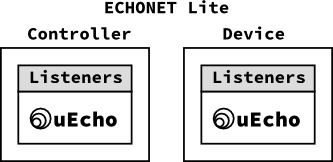

eEcho for C is a portable and cross platform development framework for creating controller applications and devices of [ECHONET Lite][enet]. [ECHONET][enet] is an open standard specification for IoT devices in Japan, it specifies more than 100 IoT devices such as crime prevention sensor, air conditioner and refrigerator.

## What is uEcho ?

The uEcho supports to control standard devices and create the standard devices of [ECHONET Lite][enet] specification easily. The uEcho is designed in an object-oriented way, and the functions are object-oriented in their naming convention, and are grouped into classes such as `Controller`, `Node`, `Class` and `Object`.

To implement IoT controller or devices of [ECHONET Lite][enet], developer had to understand and implement the communication middleware specification such as the message format and base sequences.

Using the uEcho, developer must only to prepare listeners the write request because uEcho handle other requests such as request and notification requests automatically.

To use the uEcho, developer can implement IoT controller or devices of [ECHONET Lite][enet] very easily :-)

[enet]:http://echonet.jp/english/
